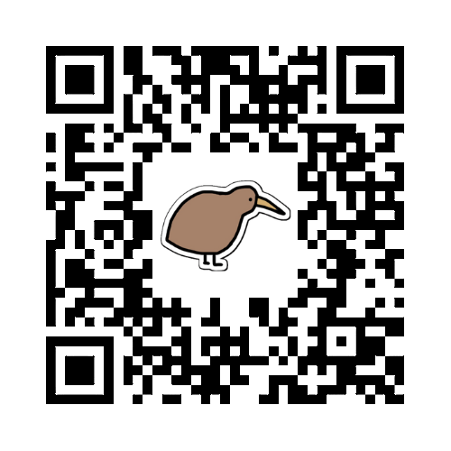

# **Kiwi**

Welcome to Kiwi, a simple, easy to use, and fun Discord bot. Built using the `discord.py` library. Kiwi is currently in development, and is not yet ready for production use. I will be adding more features and proper documentation in the future.

### **Join our Kiwi server to try it out!**

#

### **Key Features**

Tell Kiwi your deepest, darkest secrets with `confess`, ask the magic 8 ball with `magic`, and more! The `fun` commands are currently the most developed, and are the most fun (pun intended) to use.

Want to interact more with Kiwi? Try the `reaction` commands! Kiwi will react to your messages with a variety of different emojis.

Currently looking to add `react`, `game`, `math`, and `play` functions. If you have any ideas, please let me know!

#

### **How to use**

<!-- If the bot starts getting any more complicated, steps for proper setup will be documented here -->

To use Kiwi, you must first add the bot to your server. You can do this by clicking [here](https://bit.ly/kiwi-bot). You must have the `Manage Server` permission to add Kiwi to your server.

#

### **List of commands**

* #### `confess`
* #### `howgamer`
* #### `howgay`
* #### `howsimp`
* #### `imagine`
* #### `magic`
* #### `pp`
* #### `blush`
* #### `cry`
* #### `dance`
* #### `happy`
* #### `teehee`
* #### `thinking`
* #### `hug`
* #### `kill`
* #### `punch`
* #### `slap`
* #### `stare`
* #### `wave`

#

### **Version History**

* **v0.1**: Initial Release. Just added basic files so the bot can be run, and Discord bot tokens are kept locally.
* **v0.2**: Added `confess` command and extended documentation on README.md file (*Key Features*, *How to use*, *List of commands*, *Version History*).
* **v0.3**: Added `fun` commands (`howgamer`, `howgay`, `howsimp`, `imagine`, `magic`, `pp`).
* **v0.4**: Added `reaction` commands (`blush`, `cry`, `dance`, `happy`, `teehee`, `thinking`, `hug`, `kill`, `punch`, `slap`, `stare`, `wave`). Also restructured the assets folder to be more organized.

<!--
TODO: Stuff to be adding in the future to this README.md file
* Section to add the bot to your server (DONE)
* Key Features (DONE)
* How to use (DONE)
* List of commands (DONE)
* How to contribute (donations)
* Links (this ones being about tools used to make this bot)
* Version History (DONE)
* How to fork this repo and run the bot locally
-->